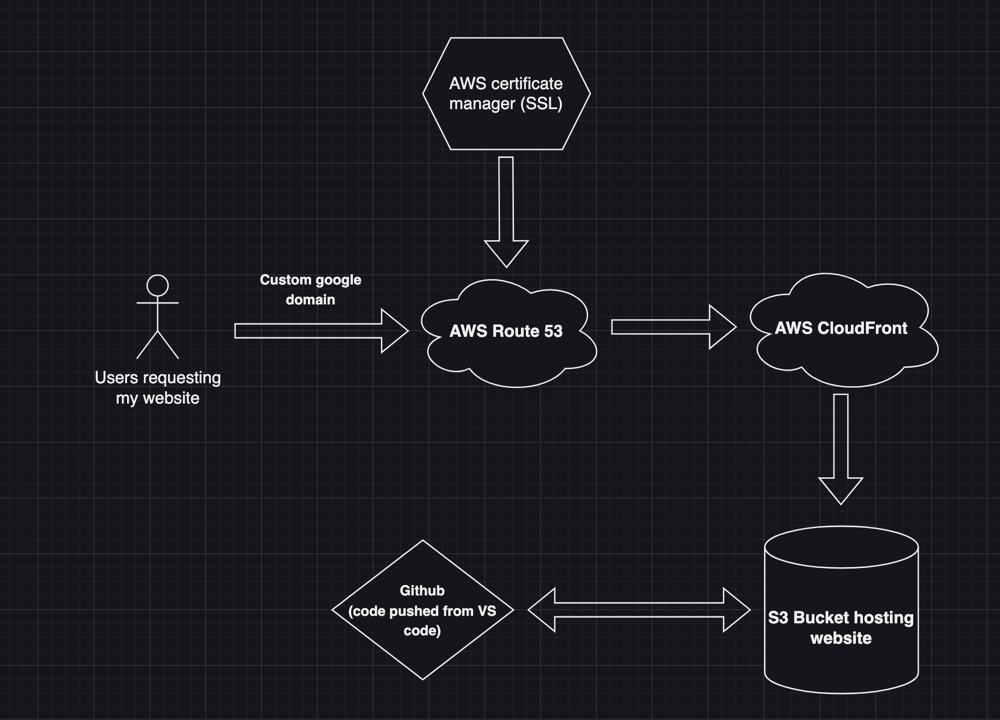

# Portfolio

This repository contains the source code for my portfolio website. It is built using Typescript, CSS, and JavaScript. The website showcases my work and provides information about me.

This project was deployed using an AWS S3 bucket.

#

## Website Infrastructure

#

#

## Images of website

#

#

## Tech stack

#

